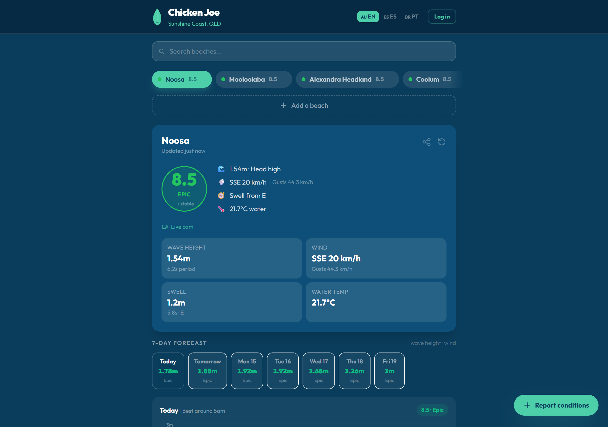

# 🤙 Chicken Joe — Community Surf Conditions

Full-stack web app that tells you whether it's worth paddling out. Live wave,
wind and tide data for any beach in the world, condensed into a single 0–10
surf score, plus a community layer where surfers post real-time reports from
the water.

> Live in production: **https://chicken-joe.vercel.app**



## Features

**Surf forecasting**
- Surf score (0–10) computed from wave height, swell period and wind
  direction relative to each beach's ocean-facing orientation (offshore vs onshore)
- 7-day hourly forecast chart (Recharts) with best-window detection per day
- Tide times, water temperature and live webcam links
- Trend indicator: tells you if conditions are improving or dropping in the next few hours

**Community**
- Live surf reports with tags (clean, messy, crowded…) — recent reports
  feed back into the surf score
- Voting on reports, plus edit/delete with inline confirmation UI
- Anyone can add any beach worldwide: search via OpenStreetMap, confirm on
  a map preview, and it's live instantly with full conditions
- Favorites (persisted locally) and nearby-beach detection via geolocation

**Accounts & moderation**
- JWT auth (register / login), user profiles with stats and report history
- Admin panel with three tabs: flagged beaches, beach suggestions
  (approve/reject) and report moderation
- Language switcher (English / Spanish), installable PWA with offline caching

## Stack

| Layer | Tech |
|---|---|
| Frontend | React 18 · Vite · Tailwind CSS · Recharts · vite-plugin-pwa |
| Backend | FastAPI · Python 3.11 · SQLite (aiosqlite) |
| Auth | JWT (python-jose) · bcrypt |
| Data | Open-Meteo (marine + weather, no API key) · Nominatim geocoding |
| Hosting | Vercel (frontend) · Render (backend) |

## Resilience & security

- In-memory TTL cache with **stale-while-error**: if the weather API rate-limits
  or fails, users get slightly-old data instead of an error screen
- Outbound API calls are throttled and retried with exponential backoff + jitter;
  graceful degradation to wave-only data when the wind API is down
- Passwords hashed with bcrypt; write endpoints require JWT, admin endpoints
  require an admin role baked into the token
- CORS origins and secrets configured via environment variables
  (`.env.example` provided, nothing sensitive in the repo)

## Run it locally

```bash
# Backend
cd backend
cp .env.example .env        # fill in SECRET_KEY etc.
pip install -r requirements.txt
uvicorn main:app --reload   # http://localhost:8000 (docs at /docs)

# Frontend (in another terminal)
cd frontend
cp .env.example .env.local
npm install
npm run dev                 # http://localhost:5173
```

## Structure

```
├── backend/             # FastAPI REST API
│   ├── main.py          # Routes: beaches, conditions, forecast, reports, admin
│   ├── auth.py          # JWT auth + /auth router
│   ├── database.py      # aiosqlite layer (reports, votes, flags, users…)
│   ├── marine_api.py    # Open-Meteo client: cache, throttle, retry, fallbacks
│   ├── scoring.py       # The 0–10 surf score algorithm
│   └── tides.py         # Harmonic tide approximation
└── frontend/            # React SPA (PWA)
    └── src/
        ├── components/  # ConditionsCard, ForecastSection, AdminPanel, modals…
        ├── api/         # Fetch client (env-based API URL)
        ├── auth/        # Auth context (JWT in localStorage)
        ├── hooks/       # useFavorites
        └── i18n/        # EN/ES translations + context
```
